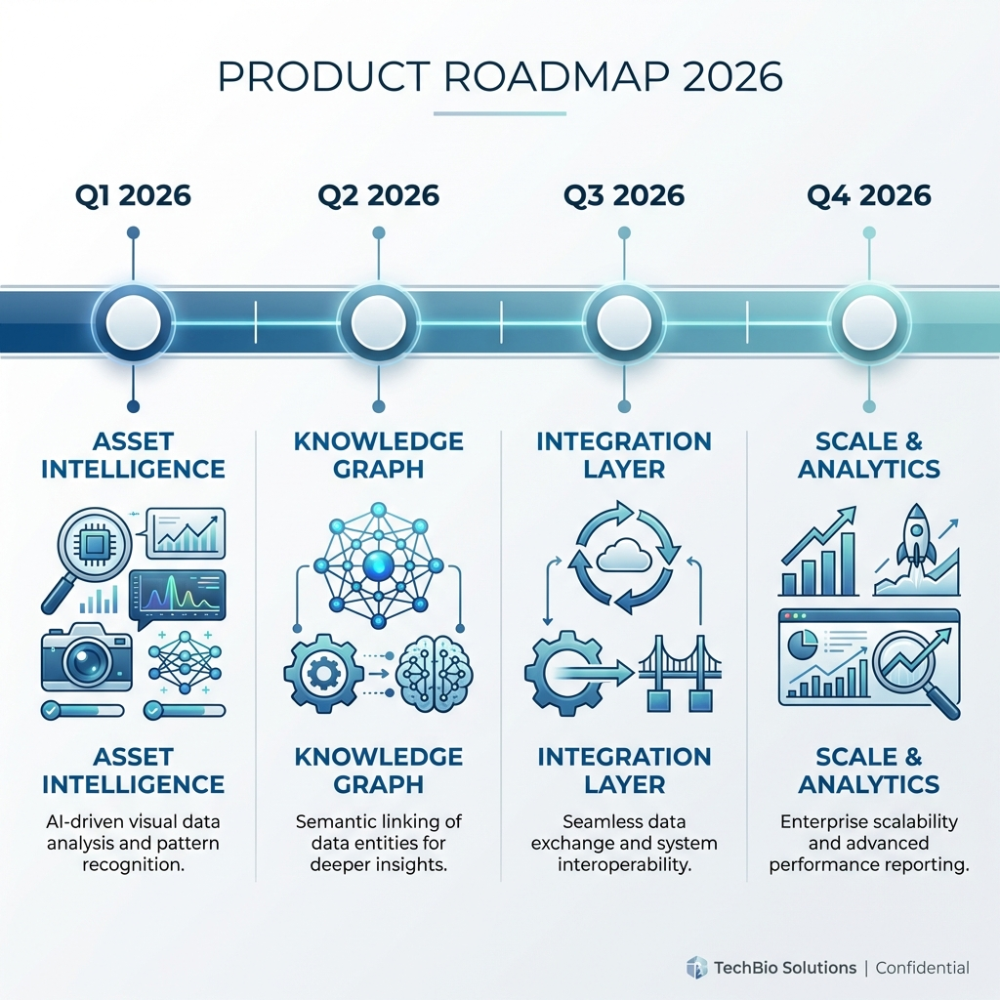

# Synthetic Persona Platform — Product Vision
## PharmaPersonaSim: AI-Powered Patient & HCP Intelligence

> **Owner**: Ishan Nag (Product Manager)  
> **Expert Advisor**: John (Ongoing Feedback)  
> **Version**: 1.0 | January 2026

---

## Executive Summary

PharmaPersonaSim transforms qualitative patient and HCP insights into quantitative intelligence using LLMs. The platform enables pharma teams to **simulate persona reactions** to campaigns—delivering insights in minutes instead of months.

---

## 2026 Product Roadmap

---

## Foundation Delivered ✅

| Capability | Description |
|------------|-------------|
| **Persona Generation** | AI-generated personas with MBT framework |
| **Cohort Simulation** | Multi-persona message testing |
| **Brand Library** | Document upload with classification |

---

## Critical Dependency

> [!CAUTION]
> **Quality depends on input quality.** Roadmap execution requires brand documentation and persona research from stakeholders.

| Priority | Input Required | Status |
|----------|---------------|--------|
| 🔴 HIGH | Brand Content (PI/Labels) | Pending |
| 🟡 MEDIUM | Persona Research Data | Pending |

---

## 6-Month Roadmap (Q1–Q2 2026)

### Q1 2026: Asset Intelligence
**Theme**: *"Visual Feedback & Refinement"*

| Deliverable | Description |
|------------|-------------|
| **Asset Analysis Engine** | AI-powered visual red-lining of marketing assets |
| **Persona-Based Annotations** | Asset feedback from persona perspectives |
| **Caching & Performance** | Response optimization for asset analysis |
| **Expert Review Cycle** | Feedback integration with John |

---

### Q2 2026: Knowledge Graph
**Theme**: *"Connected Brand Intelligence"*

| Deliverable | Description |
|------------|-------------|
| **Knowledge Extraction** | Extract insights from brand documents |
| **Entity Relationships** | Connect personas to brand knowledge |
| **Persona Grounding** | Enrich personas from knowledge context |
| **Alignment Validation** | Ensure persona-brand consistency |

---

## Annual View: Directional Themes

> [!NOTE]
> Q3-Q4 items are **directional** and depend on Q1-Q2 outcomes.

| Quarter | Theme | Focus Areas |
|---------|-------|-------------|
| **Q1** | Asset Intelligence | Visual red-lining, asset feedback |
| **Q2** | Knowledge Graph | Brand knowledge, persona grounding |
| **Q3** | Integration Layer | Veeva sync, external data sources |
| **Q4** | Scale & Analytics | Multi-brand, coverage analysis |

### Q3-Q4 Exploration Areas

- **Veeva Integration**: Sync with Veeva Vault for content management
- **Similarity Engine**: Find similar personas and insights
- **Coverage Analysis**: Measure knowledge coverage across brands
- **Auto-Enrichment**: Automated persona updates from new data
- **Multi-Brand Support**: Platform-level brand isolation

---

## Risk Management

| Risk | Mitigation |
|------|------------|
| **Data Availability** | Stakeholder engagement |
| **Expert Availability** | Async feedback process |

---

## Stakeholder Communication

| Audience | Cadence |
|----------|---------|
| Sponsors | Monthly |
| John (Expert) | Bi-weekly |
| Team | Quarterly |

---

*Product vision as of January 2026.*
