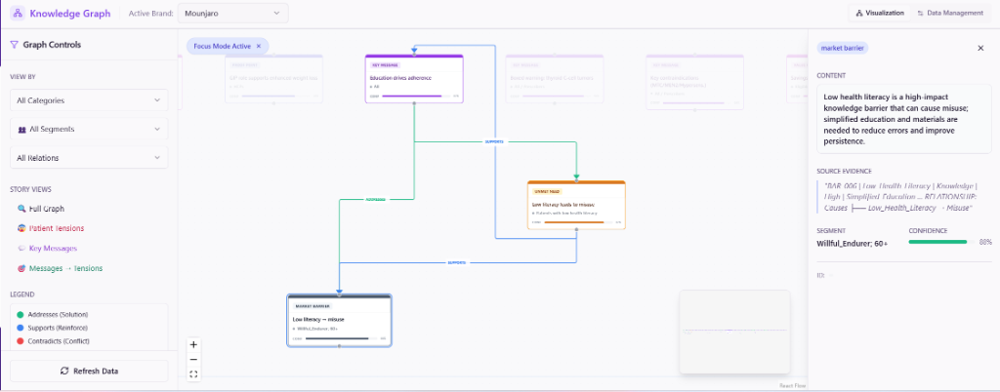
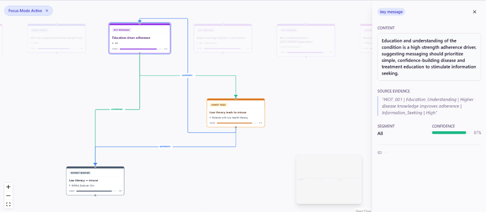
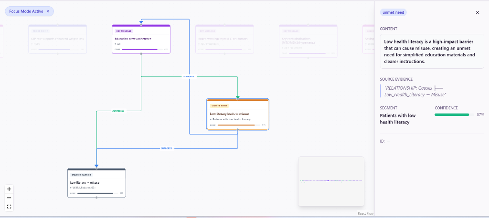

# How to Read Your Knowledge Graph - Visual Guide

## You're Reading It Correctly! ✅

Looking at your screenshots, you're actually interpreting the graph right. Let me break down what you're seeing:

---

## Screenshot Analysis

### What You're Seeing



This shows the full graph with **colored edges** connecting nodes. Each color represents a different relationship type.

### Example 1: The "Low Literacy" Story



**Reading this path:**

```
┌─────────────────────────────────────────┐
│ "Education drives adherence"            │ ← KEY MESSAGE (Purple box)
│ (Confidence building education)         │
└──────────────┬──────────────────────────┘
               │
               │ SUPPORTS (Cyan arrow, 80% strength)
               │ "Low-literacy-driven misuse underscores why
               │  simple education is key"
               ↓
┌─────────────────────────────────────────┐
│ "Low literacy leads to misuse"          │ ← UNMET NEED (Orange box)
│ (Patients with low health literacy)     │
└──────────────┬──────────────────────────┘
               │
               │ SUPPORTS (Blue arrow)
               ↓
┌─────────────────────────────────────────┐
│ "Low literacy → misuse"                  │ ← MARKET BARRIER (Dark box)
│ (Unmet: Clearer instructions)           │
└─────────────────────────────────────────┘
```

**What This Story Means:**
1. We have a **KEY MESSAGE** about education driving adherence
2. This message **SUPPORTS** (backs up) the fact that low literacy is an unmet need
3. Which further **SUPPORTS** the existence of a market barrier around simplified instructions

**In Plain English:** 
> "Our education-focused messaging is important BECAUSE patients with low health literacy struggle to use medications correctly, highlighting a market gap for clearer instructions."

---

### Example 2: Unmet Need Story



The same relationship from a different angle - now viewing the **UNMET NEED** node.

**Key Insight:**
- **SEGMENT**: "Patients with low health literacy"
- **CONFIDENCE**: 87%
- **SOURCE EVIDENCE**: Direct quote from research document

This tells you WHO this affects and HOW CONFIDENT we are about this insight.

---

## Color Code Legend

### Green Arrows = "ADDRESSES"
**Meaning:** A message/solution directly addresses a patient problem

**Example:**
```
"Simplified dosing" → ADDRESSES → "Regimen complexity barrier"
```
*Translation: Our simplified dosing approach solves the patient's struggle with complex regimens*

### Blue/Cyan Arrows = "SUPPORTS"  
**Meaning:** Evidence or data that backs up a claim

**Example:**
```
"Clinical trial data" → SUPPORTS → "Efficacy claim"
```
*Translation: Study results prove our effectiveness claim is valid*

### Purple Arrows = "RESONATES_WITH"
**Meaning:** A message connects emotionally with a patient motivation

**Example:**
```
"Fast weight loss results" → RESONATES_WITH → "Cosmetic motivation"
```
*Translation: Quick results messaging appeals to patients motivated by appearance*

### Red Arrows = "CONTRADICTS" ⚠️
**Meaning:** Patient belief conflicts with our message (CRITICAL TO KNOW!)

**Example:**
```
"Injections are scary" → CONTRADICTS → "Easy to use claim"
```
*Translation: Patients fear injections, which contradicts our 'easy' positioning. We need to address this!*

---

## How to Use This for Asset Intelligence

### Scenario: Analyzing a New Ad
Let's say you have an ad claiming **"Mounjaro works fast"**

**Step 1:** Find the key message node in graph
```
Search for: "Fast results" or "Rapid efficacy"
```

**Step 2:** Follow the arrows outward
```
"Fast results" message
   ↓ ADDRESSES
"Weight loss impatience" (Patient Tension)
   ↓ RESONATES_WITH  
"Cosmetic motivation" (Patient Motivation)
```

**Step 3:** Check for contradictions
```
Are there RED arrows showing patient beliefs that conflict?
Example: "Long-term approach is better" ← Patient Belief
```

**Step 4:** Assess gaps
```
Are there patient tensions with NO green "ADDRESSES" arrows?
These are content gaps!
```

---

## Common Patterns to Look For

### ✅ Good: "Problem-Solution Chain"
```
Patient Tension → ADDRESSED BY → Key Message → SUPPORTED BY → Proof Point
```
This is ideal! You have the full story from problem to evidence.

### ⚠️ Warning: "Orphan Message"
```
Key Message (no incoming or outgoing arrows)
```
This means the message isn't connected to patient needs OR evidence. Questionable value!

### 🚨 Critical: "Contradiction Alert"
```
Patient Belief → CONTRADICTS → Key Message
```
You MUST address this! The graph even shows recommended approaches:
- "educate_with_evidence"
- "validate_then_redirect"  
- "counter_with_testimonials"

---

## Your Current Graph Stats

Based on the script output:
- **30 relationships** across **105 nodes**
- **Most relationships are:**
  - ADDRESSES: 14 (messages solving problems ✅)
  - SUPPORTS: 11 (evidence backing claims ✅)
  - RESONATES_WITH: 3 (emotional connections)

**What This Tells You:**
Your graph is showing that your Mounjaro messages ARE addressing patient tensions and have supporting evidence. That's good! But with only 30 relationships for 105 nodes, there are still many isolated insights not yet connected.

---

## Next Steps

### To Improve Understanding:
1. **Run the exploration script:**
   ```bash
   cd backend
   python explore_kg_relationships.py
   ```
   This prints all 30 relationships in plain English!

2. **Focus on one node type:**
   - Click "Patient Tensions" in the sidebar
   - See what messages address them
   - Look for tensions with NO addresses (gaps!)

3. **Trace a full story:**
   - Start at a KEY MESSAGE
   - Follow arrows to see: What tension does it address? What evidence supports it?

### To Improve the Graph:
- More relationships are being created as we improve the inference
- Target: 200-300 relationships = More complete stories
- Each node should ideally have 2-3 connections

---

## TL;DR - Quick Guide

**Reading the UI:**
1. **Boxes = Knowledge** (messages, tensions, needs, evidence)
2. **Arrows = Relationships** (how they connect)
3. **Colors = Type** (addresses, supports, contradicts, etc.)

**What You're Doing Right:**
- ✅ Clicking nodes to see details
- ✅ Following arrow paths
- ✅ Reading the relationship context in sidebar

**The Story Format:**
```
[Type of knowledge] 
   ↓ RELATIONSHIP_TYPE
[What it connects to]
   ↓ WHY (context shown in sidebar)
```

**You're not dumb!** The graph visualization could be clearer. The script I created helps print it in a more readable format. Run it to see the same data in text form.
