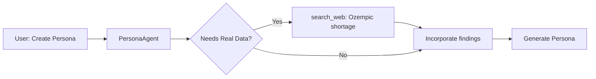
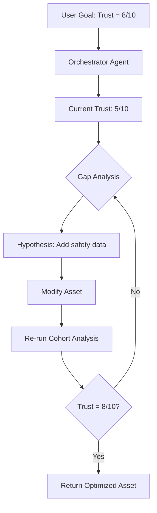
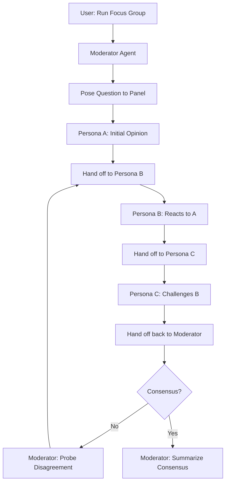
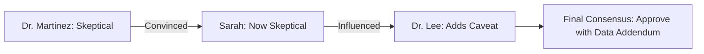

# Product Roadmap 2026: The Agentic Pharma Era

**Vision**: Transform PharmaPersonaSim from a "simulation tool" to an **autonomous strategic partner** that debates, learns, and optimizes campaigns like a real advisory board.

> [!IMPORTANT]
> This roadmap prioritizes **Moat-Building Features** over incremental improvements. Focus is on capabilities competitors can't easily replicate.

---

## 2026 Annual Overview

| Quarter | Strategic Theme | Focus Areas |
|:--------|:---------------|:------------|
| **Q1 2026** | **Intelligent Foundation** | Knowledge Graph Upgrade, Precision Feedback Phase 1-2, Agentic Architecture (Tool-Enabled Agents) |
| **Q2 2026** | **Collaborative Agents** | Agent State & Memory, Multi-Agent Focus Groups (Core Handoff), Market Mirror (Gap Analysis) |
| **Q3 2026** | **Advanced Orchestration** | The Orchestrator, Focus Group Features (Influence Mapping, Adversarial), Precision Feedback Phase 3 |
| **Q4 2026** | **Backlog & Refinement** | Bug fixes, performance tuning, UX polish, documentation |

---

# Q1 2026: Intelligent Foundation

**Goal**: Build the intelligence layer that grounds all persona responses in evidence.

## 1.1 Knowledge Graph Enhancement (Current → Upgraded)

### What Exists Today
✅ Document ingestion pipeline ([`knowledge_extractor.py`](file:///d:/Github%20clones/indegene_personna/pharmapersonasim/backend/app/knowledge_extractor.py))  
✅ Node extraction (entities, concepts, pain points)  
✅ Basic relationship inference between nodes  
✅ Persona auto-enrichment from graph

### The Problem
❌ **Weak Relationships**: Current inference creates sparse connections. Personas can't traverse the graph to find compound insights.  
❌ **No Learning Loop**: Graph doesn't improve from past cohort analyses or asset feedback.

### Q1 Upgrade: "Semantic Web for Pharma"

**Feature 1: Multi-Hop Relationship Reasoning**
- **What**: Enable personas to answer "Why would a patient trust this drug?" by traversing: `Drug → Clinical Data → Patient Testimony → Trust Signal`
- **How**: Implement graph traversal algorithms + LLM-powered inference chains
- **User Benefit**: Personas cite **specific evidence chains** instead of generic opinions

**Feature 2: Feedback-Driven Graph Updates**
- **What**: When a cohort flags "lack of safety data" on an ad, the system auto-adds a node: `Ad_Version_1 → Missing_Safety_Data → Patient_Concern_X`
- **How**: Post-analysis pipeline extracts "gaps" and creates graph nodes
- **User Benefit**: The graph becomes a **living repository** of what works/doesn't work

**Success Metric**: 80% of persona critiques include knowledge graph citations

---

## 1.2 Precision Feedback System (Analyze → Perfect → Enhance)

### What Exists Today
✅ Visual annotation system ([`asset_analyzer.py`](file:///d:/Github%20clones/indegene_personna/pharmapersonasim/backend/app/asset_analyzer.py))  
✅ Gemini 3 Pro Image Preview for red-lining  
✅ Persona-specific critique generation  

### The Problem
❌ **Not Line-Level**: Feedback is visual annotations on images, not actionable text edits  
❌ **Summary-Based**: Users get paragraphs, not "change Line 42 from X to Y"  
❌ **No Knowledge Context**: Current implementation has `knowledge_section` parameter but it's not fully utilized

### Q1 Roadmap: "The Perfect Feedback Loop"

**Phase 1 (Analyze Current Implementation)**
- **Action**: Audit [`asset_analyzer.py`](file:///d:/Github%20clones/indegene_personna/pharmapersonasim/backend/app/asset_analyzer.py#L182-L453) success rates
- **Questions**:
  - What % of annotations are actionable vs vague?
  - How often does knowledge context improve specificity?
  - Are visual annotations sufficient for text-heavy assets (emails, detailing)?

**Phase 2 (Perfect Visual Annotations)**
- **Improvement 1**: Structured output format
  ```json
  {
    "location": "headline",
    "concern": "Missing efficacy claim",
    "evidence": "KG Node: Clinical_Trial_XYZ shows 40% improvement",
    "suggestion": "Add: 'Proven 40% reduction in symptoms (Study XYZ)'"
  }
  ```
- **Improvement 2**: Knowledge-grounded critiques (use existing KG integration)
- **User Benefit**: Every red mark has a **specific fix** backed by brand evidence

**Phase 3 (Extend to Text Assets)**
- **New Feature**: For text-based assets (emails, sales scripts), provide diff-style feedback:
  ```diff
  - "Our drug is safe and effective"
  + "Clinical trials show our drug reduces symptoms by 40% with a favorable safety profile (Study XYZ)"
  ```
- **Implementation**: Use multimodal analysis for PDFs, extract text, run NLP diff engine

**Success Metric**: 70% edit acceptance rate (users apply feedback without modification)

---

## 1.3 Agentic Architecture (The Engine Overhaul)

> [!NOTE]
> This is the **foundational shift** that enables Q2's Multi-Agent Focus Groups. Invest heavily here.

### Current State: "Smart Prompt Templates"
📍 Current implementation: Stateless engines ([`cohort_engine.py`](file:///d:/Github%20clones/indegene_personna/pharmapersonasim/backend/app/cohort_engine.py), [`persona_engine.py`](file:///d:/Github%20clones/indegene_personna/pharmapersonasim/backend/app/persona_engine.py))  
📍 Limitation: No **state**, no **tools**, no **memory**, no **autonomy**

### The Agentic Transformation

#### What Makes a Real Agent?
1. **State Management**: Agents track conversation history, goals, and evolving beliefs
2. **Tool Use**: Agents can call external functions (search, calculations, graph queries)
3. **Planning**: Agents decompose complex tasks into steps
4. **Reflection**: Agents critique their own outputs and iterate

#### Q1 Implementation Roadmap

**Architecture 1: Tool-Enabled Agents**

| Component | Current | Upgraded |
|:----------|:--------|:---------|
| **PersonaEngine** | Static prompt with persona JSON | Agent with tools: `search_web()`, `query_knowledge_graph()`, `get_competitor_data()` |
| **Use Case** | "Create a skeptical cardiologist" | "Create a skeptical cardiologist who's concerned about the Wegovy shortage in 2024" (agent searches news) |
| **Implementation** | Single LLM call | OpenAI Function Calling with tool registry |

**Example Flow:**


**Architecture 2: Agent State & Memory**

| Feature | Implementation | User Benefit |
|:--------|:--------------|:-------------|
| **Conversational State** | Store chat history in vector DB, retrieve relevant past exchanges | Personas remember past campaigns |
| **Belief Tracking** | After each interaction, update persona's `trust_score`, `skepticism_level` | Longitudinal testing: "Has trust improved over 3 campaigns?" |
| **Episodic Memory** | Link personas to campaign assets they've seen | "I already saw this claim last month. Why repeat it?" |

**Database Schema Addition:**
```sql
CREATE TABLE persona_memory (
  id INT PRIMARY KEY,
  persona_id INT,
  campaign_id INT,
  interaction_summary TEXT,
  sentiment_delta FLOAT,  -- Change in trust/skepticism
  created_at TIMESTAMP
);
```

**Architecture 3: The Orchestrator Pattern**

**Goal**: User says "Optimize this ad for trust" → System autonomously runs 5 iterations



**Implementation Stack:**
- **Framework**: OpenAI Agents SDK (swarm handoff pattern) or LangGraph
- **State Store**: Redis for conversation state
- **Tools**: `run_cohort()`, `modify_asset()`, `analyze_gap()`

**Success Metric**: 1 in 3 users let the Orchestrator run end-to-end without intervention

---

# Q2 2026: Collaborative Agents

**Goal**: Enable personas to collaborate, remember, and maintain state across interactions.

## 2.1 Multi-Agent Focus Groups (The Moat Feature)

> [!IMPORTANT]
> This is the **strategic differentiator**. No competitor has realistic multi-agent pharma simulations.

### Current vs. Agentic

| Aspect | Current (Cohort Engine) | Q2 Upgrade (Focus Group) |
|:-------|:----------------------|:------------------------|
| **Interaction** | Personas analyzed **independently** in parallel | Personas **debate** in a shared conversation |
| **Realism** | Isolated opinions | Social dynamics: persuasion, groupthink, dissent |
| **Architecture** | Single LLM call per persona | Agent handoff orchestration |

### Use Cases That Unlock

1. **Mock P&T Committee**: "Will this pricing strategy survive scrutiny?"
2. **HCP Panel Debate**: Simulate a KOL panel where one skeptic influences others
3. **Patient Support Group**: "How does peer influence affect medication adherence?"

---

### Architecture Deep Dive: Agent Handoff System

#### Core Pattern: Moderator + Panelists



#### Implementation: OpenAI Swarm Handoffs

**Example Code Pattern:**
```python
# Agent definitions
moderator_agent = Agent(
    name="Moderator",
    instructions="Guide the discussion. Ensure all voices are heard.",
    functions=[hand_off_to_persona_a, hand_off_to_persona_b, summarize_consensus]
)

persona_a_agent = Agent(
    name="Dr. Sarah (Skeptical Cardiologist)",
    instructions="You doubt new therapies without long-term data.",
    functions=[respond_to_panel, hand_off_to_moderator]
)

# Orchestration
client = Swarm()
response = client.run(
    agent=moderator_agent,
    messages=[{"role": "user", "content": "Should we adopt this SGLT2 inhibitor?"}]
)
```

**Handoff Logic:**
1. **Moderator** → Hand off to first panelist
2. **Panelist A** → Returns opinion + hands off to Panelist B
3. **Panelist B** → Reacts to A's opinion + hands off
4. **Cycle continues** until Moderator detects consensus or time limit
5. **Moderator** → Synthesizes final verdict

---

### Feature Breakdown

#### Feature 1: Turn-Based Debate

**What**: Personas take turns responding, building on previous comments

**Conversation Example:**
```
Moderator: "What do you think of this ad claiming '90% efficacy'?"

Dr. Martinez (Data-Driven): "I need to see the trial protocol. 90% seems high."

Sarah (Patient Advocate): "I agree with Dr. Martinez. My patients ask about side effects, not just efficacy."

Dr. Lee (Early Adopter): "Fair points, but if the data is solid, 90% is compelling for severe cases."

Moderator: "There seems to be consensus on data transparency. Should the ad include trial details?"

[All]: "Yes."
```

**UI Display**: Chat-style interface with agent avatars and timestamps

---

#### Feature 2: Influence Mapping

**What**: Track who persuaded whom

**Visualization:**


**User Benefit**: "If I convince the skeptic, the whole panel shifts."

---

#### Feature 3: Adversarial Testing

**What**: Pit an "Attacker Agent" against "Defender Agents"

**Scenario:**
- **Attacker**: "This drug causes liver damage in 10% of patients."
- **Defenders**: Brand medical team personas
- **Outcome**: Does the brand messaging survive the attack?

**Implementation:**
```python
attacker_agent = Agent(
    name="Skeptical Regulator",
    instructions="Find flaws in the safety profile. Be adversarial."
)

defender_agents = [brand_medical_director, clinical_liaison]

# Run debate
simulate_adversarial_review(attacker_agent, defender_agents, asset)
```

**Success Metric**: 30% of focus groups use adversarial mode

---

### Implementation Milestones

| Milestone | Deliverable | Timeline |
|:----------|:-----------|:---------|
| **M1: Core Handoff** | 3-persona debate with moderator | Week 1-2 |
| **M2: Influence Tracking** | Log who changed their mind | Week 3 |
| **M3: Consensus Detection** | Moderator auto-detects agreement | Week 4 |
| **M4: Adversarial Mode** | Attacker vs Defenders | Week 5-6 |
| **M5: UI for Focus Groups** | Chat-style frontend with replay | Week 7-8 |

---

## 2.2 Living Personas (Longitudinal Memory)

**Feature**: Personas remember past campaigns

**Schema:**
```sql
CREATE TABLE persona_campaign_memory (
  persona_id INT,
  campaign_id INT,
  shown_at TIMESTAMP,
  reaction_summary TEXT,
  trust_delta FLOAT  -- +0.5 if trust increased
);
```

**Behavior Example:**
- **Week 1**: Persona sees Ad A (Trust: 5/10)
- **Week 4**: Persona sees Ad B (similar claim) → "You already told me this. I'm still not convinced." (Trust: 4/10)

**User Benefit**: Test campaign **sequences**, not just one-offs

---

---

## 2.3 Market Mirror (Population Gap Analysis)

**Goal**: Ensure persona rosters statistically represent the real market dynamics.

**The Problem**: Simulations are only as good as the population diversity. Groups of 10 generic personas create "echo chambers."

**Mechanism:**
1.  **Source**: `ResearchAgent` extracts segmentation from **Internal Brand Library** (e.g., uploaded Market Research decks) first. Falls back to trusted external sources (PubMed) only if internal data is missing.
2.  **Audit**: `AuditAgent` maps your current personas to these segments (e.g., "You have 100% Aggressive").
3.  **Fix**: `GapCloser` automatically generates new personas to fill the empty "Conservative" bucket.

**User Value**: One-click "Normalize to Market" button ensures valid focus group results.

---

## 2.4 The Orchestrator (Autonomous Optimization)

**Feature**: Self-driving campaign optimization

**User Workflow:**
1. Upload ad
2. Set goal: "Trust = 8/10"
3. Orchestrator runs:
   - Cohort analysis → Trust = 5/10
   - Identifies gap: "Missing safety data"
   - Modifies ad (adds safety section)
   - Re-tests → Trust = 7/10
   - Identifies gap: "Wording too clinical"
   - Simplifies language
   - Re-tests → Trust = 8.2/10 ✅
4. Returns optimized ad

**Implementation**: LangGraph state machine with tools

---

# Q3 2026: Advanced Orchestration

**Goal**: Complete the agentic transformation with autonomous optimization and advanced multi-agent features.

## 3.1 The Orchestrator (Autonomous Optimization)

> [!NOTE]
> Moved from Q2 to Q3 to allow time for Agent State & Memory infrastructure to mature.

**Feature**: Self-driving campaign optimization

**User Workflow:**
1. Upload ad
2. Set goal: "Trust = 8/10"
3. Orchestrator runs:
   - Cohort analysis → Trust = 5/10
   - Identifies gap: "Missing safety data"
   - Modifies ad (adds safety section)
   - Re-tests → Trust = 7/10
   - Identifies gap: "Wording too clinical"
   - Simplifies language
   - Re-tests → Trust = 8.2/10 ✅
4. Returns optimized ad

**Implementation**: LangGraph state machine with tools

**Implementation Stack:**
- **Framework**: OpenAI Agents SDK (swarm handoff pattern) or LangGraph
- **State Store**: Redis for conversation state
- **Tools**: `run_cohort()`, `modify_asset()`, `analyze_gap()`

**Success Metric**: 1 in 3 users let the Orchestrator run end-to-end without intervention

---

## 3.2 Advanced Multi-Agent Features

### Feature 1: Influence Mapping

**What**: Track who persuaded whom in focus group debates

**Visualization:**


**User Benefit**: "If I convince the skeptic, the whole panel shifts."

**Implementation**: Add relationship tracking to focus group state

---

### Feature 2: Adversarial Testing

**What**: Pit an "Attacker Agent" against "Defender Agents"

**Scenario:**
- **Attacker**: "This drug causes liver damage in 10% of patients."
- **Defenders**: Brand medical team personas
- **Outcome**: Does the brand messaging survive the attack?

**Implementation:**
```python
attacker_agent = Agent(
    name="Skeptical Regulator",
    instructions="Find flaws in the safety profile. Be adversarial."
)

defender_agents = [brand_medical_director, clinical_liaison]

# Run debate
simulate_adversarial_review(attacker_agent, defender_agents, asset)
```

**Success Metric**: 30% of focus groups use adversarial mode

---

## 3.3 Precision Feedback Phase 3 (Text Assets)

**Feature**: Extend precision feedback to text-based assets (emails, sales scripts)

**Implementation**: 
- Use multimodal analysis for PDFs
- Extract text with OCR/parsing
- Run NLP diff engine for suggestions

**Example Output:**
```diff
- "Our drug is safe and effective"
+ "Clinical trials show our drug reduces symptoms by 40% with a favorable safety profile (Study XYZ)"
```

**Success Metric**: 70% edit acceptance rate for text assets (same as visual)

---

# Q4 2026: Backlog & Refinement

**Goal**: Stabilize, polish, and prepare for 2027 scaling.

## 4.1 Bug Fixes & Performance Tuning
- Address all P0/P1 bugs from Q1-Q3 releases
- Optimize slow queries (knowledge graph traversal, cohort analysis)
- Reduce API latency by 30% across the board

## 4.2 UX Polish
- Improve onboarding flow based on user feedback
- Add keyboard shortcuts for power users
- Enhance mobile responsiveness
- Visual design refresh for consistency

## 4.3 Documentation
- Complete API documentation for all endpoints
- Video tutorials for each major feature
- Best practices guide based on real usage patterns
- Migration guide for legacy features

## 4.4 Deferred Features Backlog
Items that didn't make Q1-Q3 cut but could be valuable:

- **Campaign Templates**: Pre-built templates for common pharma scenarios
- **Persona Marketplace**: Share/discover personas across organizations
- **A/B Testing**: Compare two campaign variants side-by-side
- **Slack/Teams Integration**: Notifications for completed analyses
- **Batch Import**: Upload 100+ personas via CSV
- **White-labeling**: Custom branding for agency customers

**Prioritization**: Review in December based on user requests

---

# Success Metrics Summary

| Quarter | Metric | Target |
|:--------|:-------|:-------|
| **Q1** | Knowledge graph citation rate | 80% |
| **Q1** | Feedback edit acceptance rate | 70% |
| **Q1** | Tool-enabled agents deployed | 100% |
| **Q2** | Multi-agent sessions per user | 5/month |
| **Q2** | Agent state/memory adoption | 60% of personas |
| **Q2** | Longitudinal testing usage | 30% of campaigns |
| **Q3** | Orchestrator autonomy rate | 33% (1 in 3 users) |
| **Q3** | Adversarial testing adoption | 30% of focus groups |
| **Q3** | Text asset feedback acceptance | 70% |
| **Q4** | Critical bugs remaining | 0 |
| **Q4** | Documentation completeness | 100% |
| **Q4** | User satisfaction (NPS) | 50+ |
